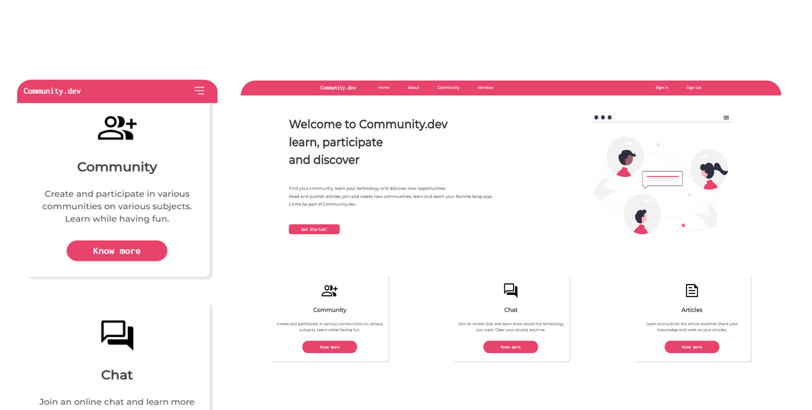
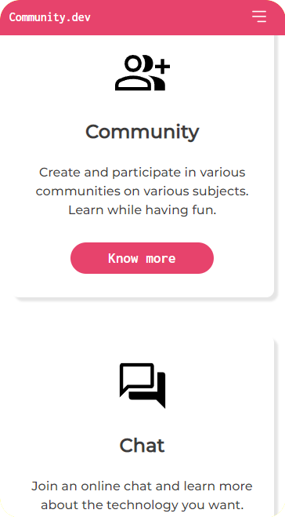
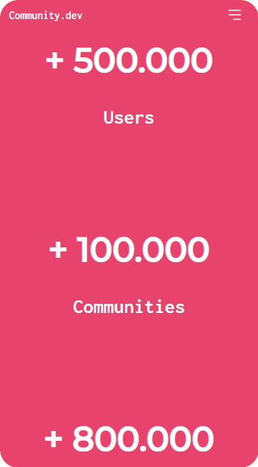
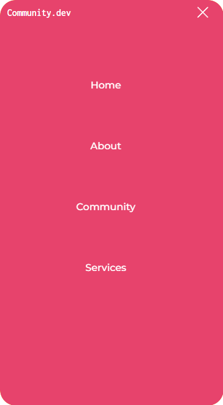

<h1> [Project in progress...] - Community.dev </h1>

<h2> Some project images </h2>

 

 

 

    
    
    
    

 

PROJECT IN PROGRESS.: <a> https://incomparable-salmiakki-f4aa45.netlify.app </a>